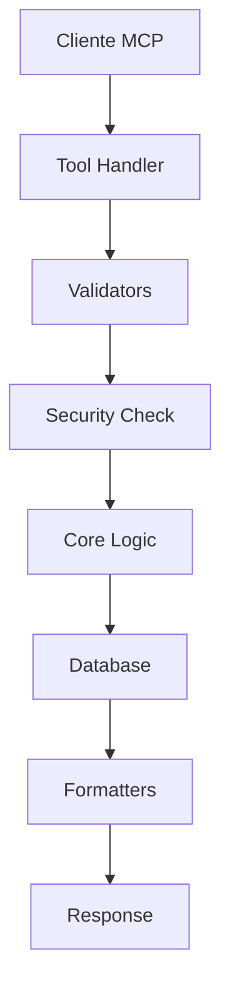

# Arquitectura y Estructura del Proyecto MCP

Este documento describe una estructura de directorios recomendada para organizar el código fuente del servidor MCP para PostgreSQL. El objetivo es separar las responsabilidades, mejorar la mantenibilidad y facilitar el crecimiento del proyecto.

## Estructura de Directorios Propuesta

Se propone la siguiente organización dentro del directorio `src/mcp_postgres/`:

```text
src/mcp_postgres/
├── __init__.py
├── main.py                    # Punto de entrada del servidor MCP
├── config/
│   ├── __init__.py
│   ├── settings.py           # Configuración de la aplicación
│   └── database.py           # Configuración específica de BD
├── core/
│   ├── __init__.py
│   ├── connection.py         # Pool de conexiones y transacciones
│   ├── security.py           # Validación de permisos y roles
│   └── context.py            # Manejo del contexto MCP
├── tools/
│   ├── __init__.py
│   ├── query_tools.py        # Herramientas de consulta básica
│   ├── schema_tools.py       # Metadata y estructura de BD
│   ├── analysis_tools.py     # Análisis estadístico de datos
│   ├── data_tools.py         # Gestión de datos (CRUD)
│   ├── relation_tools.py     # Herramientas de relaciones
│   ├── performance_tools.py  # Análisis de rendimiento
│   ├── backup_tools.py       # Backup y restore
│   ├── admin_tools.py        # Administración de BD
│   ├── validation_tools.py   # Validación e integridad
│   │── generation_tools.py   # Generación de código/SQL
│   └── register_tools.py    # Registro de herramientas
├── utils/
│   ├── __init__.py
│   ├── validators.py         # Validadores de entrada
│   ├── formatters.py         # Formateadores de salida
│   ├── exceptions.py         # Excepciones personalizadas
│   └── helpers.py            # Funciones auxiliares
```

---

## Descripción de los Directorios

### ⚙️ `config/`

**Propósito**: Centraliza toda la configuración de la aplicación.

- `settings.py`: Configuración general (logging, timeouts, límites)
- `database.py`: Configuración específica de PostgreSQL (pool, SSL, etc.)

### 📦 `core/`

**Propósito**: Contiene la lógica de negocio principal y los componentes fundamentales.

- `connection.py`: Gestiona el pool de conexiones, transacciones y ejecución de queries
- `security.py`: Validación de permisos, roles y seguridad antes de ejecutar herramientas
- `context.py`: Manejo del contexto MCP y estado de la sesión

### 🛠️ `tools/`

**Propósito**: Alberga todas las herramientas MCP organizadas por funcionalidad. Basado en las 50+ herramientas definidas en `tools.md`:

- `query_tools.py`: **3 herramientas** - Ejecución de consultas básicas
  - `execute_query`, `execute_raw_query`, `count_rows`

- `schema_tools.py`: **8 herramientas** - Metadata y estructura de BD
  - `list_databases`, `list_tables`, `list_views`, `describe_table`, `get_table_indexes`, `get_table_constraints`, `list_functions`, `list_procedures`

- `analysis_tools.py`: **4 herramientas** - Análisis estadístico
  - `analyze_table`, `get_table_size`, `find_duplicates`, `get_column_stats`

- `data_tools.py`: **4 herramientas** - Gestión de datos (CRUD)
  - `insert_data`, `update_data`, `delete_data`, `bulk_insert`

- `relation_tools.py`: **3 herramientas** - Manejo de relaciones
  - `get_foreign_keys`, `get_referenced_tables`, `generate_join_query`

- `performance_tools.py`: **3 herramientas** - Análisis de rendimiento
  - `explain_query`, `get_slow_queries`, `get_table_statistics`

- `backup_tools.py`: **3 herramientas** - Backup y restore
  - `export_table_csv`, `import_csv_to_table`, `create_table_backup`

- `admin_tools.py`: **4 herramientas** - Administración de BD
  - `get_database_info`, `get_connection_info`, `vacuum_table`, `reindex_table`

- `validation_tools.py`: **3 herramientas** - Validación e integridad
  - `validate_query`, `check_table_integrity`, `find_orphaned_records`

- `generation_tools.py`: **3 herramientas** - Generación de código/SQL
  - `generate_create_table_sql`, `generate_insert_template`, `generate_model_class`

### ✨ `utils/`

**Propósito**: Funciones y clases de utilidad reutilizables.

- `validators.py`: Validación de entradas (nombres de tabla, sintaxis SQL, etc.)
- `formatters.py`: Formateo de salidas (tablas, JSON, Markdown, CSV)
- `exceptions.py`: Excepciones personalizadas para manejo granular de errores
- `helpers.py`: Funciones auxiliares comunes (conversiones, utilidades SQL)

### 🧪 `tests/`

**Propósito**: Suite completa de pruebas organizadas por módulos.

- `test_tools/`: Tests para cada categoría de herramientas
- `test_core/`: Tests para componentes core
- `test_utils/`: Tests para utilidades

---

## Principios de Diseño

### 🎯 Separación de Responsabilidades

- **Tools**: Solo definen la interfaz MCP y validan parámetros
- **Core**: Contiene la lógica de negocio y acceso a datos
- **Utils**: Funciones puras y reutilizables

### 🔒 Seguridad por Capas

1. **Validación de entrada** en utils/validators.py
2. **Autorización** en core/security.py
3. **Sanitización SQL** en core/connection.py

### 📊 Manejo de Errores Consistente

- Excepciones personalizadas en utils/exceptions.py
- Logging estructurado en toda la aplicación
- Respuestas de error estandarizadas

### ⚡ Performance

- Pool de conexiones optimizado
- Queries preparados cuando sea posible
- Timeouts configurables
- Métricas de rendimiento

---

## Flujo de Ejecución



1. **Recepción**: Tool recibe parámetros del cliente MCP
2. **Validación**: utils/validators valida formato y tipos
3. **Autorización**: core/security verifica permisos
4. **Ejecución**: core/connection ejecuta operación en BD
5. **Formateo**: utils/formatters prepara respuesta
6. **Respuesta**: Retorna resultado al cliente MCP

---

## Configuración y Deployment

### Variables de Entorno

```bash
# Database
POSTGRES_HOST=localhost
POSTGRES_PORT=5432
POSTGRES_DB=mydb
POSTGRES_USER=user
POSTGRES_PASSWORD=password

# MCP Server
MCP_SERVER_PORT=3000
MCP_LOG_LEVEL=INFO
MCP_MAX_CONNECTIONS=10
MCP_QUERY_TIMEOUT=30
```

### Instalación y Setup

```bash
# Instalar dependencias
uv sync

# Ejecutar tests
uv run pytest

# Iniciar servidor MCP
uv run python -m mcp_postgres
```

---

## Roadmap de Implementación

### Fase 1: Core Infrastructure

- [ ] Configuración y settings
- [ ] Pool de conexiones
- [ ] Sistema de logging
- [ ] Manejo de excepciones

### Fase 2: Tools Básicos

- [ ] Query tools (3 herramientas)
- [ ] Schema tools (8 herramientas)
- [ ] Validadores básicos

### Fase 3: Tools Avanzados

- [ ] Analysis tools (4 herramientas)
- [ ] Data management tools (4 herramientas)
- [ ] Performance tools (3 herramientas)

### Fase 4: Tools Especializados

- [ ] Backup tools (3 herramientas)
- [ ] Admin tools (4 herramientas)
- [ ] Generation tools (3 herramientas)

### Fase 5: Testing y Optimización

- [ ] Suite completa de tests
- [ ] Optimización de performance
- [ ] Documentación completa
